# WindowMover

A Windows system tray utility that moves windows between monitors using only the
mouse.

<picture>
  <source media="(prefers-color-scheme: dark)" srcset="docs/pull-window-dark.svg">
  
</picture>

## What it does

Use it when a window is on a monitor you've turned off, or when no keyboard is in
reach. It has two actions:

1. **Pull** - the window comes to the monitor your cursor is on.
2. **Cycle** - the window goes to the next monitor from the one it is on, in the
   order Windows lists them, wrapping back to the first after the last.

## Controls

| Button | Role |
|---|---|
| Left-click | Puts a window in focus (for example, click its taskbar icon) |
| Hold Mouse4 | Selects pull |
| Hold Mouse5 | Selects cycle |
| Middle-click | Activates the selected action on the focused window |

Mouse4 is the back thumb button and Mouse5 the forward one, on most mice. If both
are held, pull wins. The taskbar, desktop icons, tool windows and very small UI
elements are ignored.

## Running it

Download one of the two exes from
[Releases](https://github.com/unoriginalnickname/WindowMover/releases) and run it:

- **`WindowMover.exe`** (about 200 KB) needs the
  [.NET 10 Desktop Runtime](https://dotnet.microsoft.com/download/dotnet/10.0).
  If it is missing, Windows says so when you start the exe and links to the
  download.
- **`WindowMover-standalone.exe`** (about 50 MB) has the runtime built in and
  needs nothing installed.

It appears in the system tray, and only one copy runs at a time.

The exe is not signed, so Windows SmartScreen may warn about it the first time.
Choose **More info**, then **Run anyway**.

## Tray menu

- **Start with Windows** - start it when you log in.
- **Hide window while it moves** - on by default. The window turns invisible
  until it has stopped moving, so you don't see it resize and re-maximize on the
  way. Turn it off if you'd rather WindowMover never changed how your windows
  are drawn.
- **Show where the window landed** - on by default. A brief outline with the
  monitor's number appears where the window landed, fading out over about half a
  second. Turn it off for a silent move.
- **About** - shows the controls.
- **Exit**

## How it works

A low-level mouse hook (`WH_MOUSE_LL`) sees every mouse button press system-wide.
When a side button goes down, WindowMover notes which window has focus. When the
middle button is clicked, it checks which side button is still held: Mouse4 means
pull and Mouse5 means cycle. If both side buttons were released, nothing moves.

A maximized window ignores new bounds, so it is restored, moved and maximized
again, and Windows animates each step. Some apps resize themselves when they land
on a monitor with different scaling, overriding the size WindowMover just set;
`MoveSettleWatcher` watches for that (via `EVENT_OBJECT_LOCATIONCHANGE`, not
polling) and corrects it back. In both cases the window is made fully transparent
until it has stopped changing. That moment is watched for, not guessed with a
timer, because the maximize animation keeps running after the call that started
it returns. Transparency is used instead of `ShowWindow(SW_HIDE)` so the window
keeps its taskbar button, its place in the Z-order and its focus.

It does not bring the moved window to the front. Windows refuses that to a
background app while you're using another one (see ISSUES.md #6). The landing
outline is WindowMover's own window, so it can draw on top of anything without
taking focus or catching clicks.

## Project layout

| Project | What it is |
|---|---|
| `WindowMover.App` | The Windows Forms app: P/Invoke, the mouse hook, the tray icon |
| `WindowMover.Core` | The logic that decides which window moves and where it lands |
| `WindowMover.Tests` | xUnit tests for the core - pure logic, instant, silent |
| `WindowMover.LiveTests` | xUnit tests that move real windows on the real desktop |

Inside `WindowMover.App`, one folder per job:

| Folder | What is in it |
|---|---|
| `Input/` | `MouseGestureHook` - the low-level mouse hook, turning button events into a move |
| `Moving/` | `MovableWindowCheck` (may this window be moved), `MoveTargetBounds` (where it lands), `WindowMove` (the move itself), `WindowTransparency` (hiding it on the way), `MoveSettleWatcher` (what happens after, until it stops changing) |
| `Feedback/` | `MoveIndicator` - the outline drawn where the window landed |
| `Tray/` | `SystemTrayIcon`, `UserSettings`, `StartupRegistry` |
| `Win32/` | `NativeMethods` - every P/Invoke in the app |
| `Diagnostics/` | `DebugLog` - written to `%TEMP%\windowmover-debug.log` |

A move reads top to bottom: `MouseGestureHook` sees the gesture and asks
`ButtonComboTracker` (in `WindowMover.Core`) what it means, `WindowMove` carries it
out, and `MoveSettleWatcher` watches what the app does about it afterwards.

## Building and testing

Requires the .NET SDK. The app targets `net10.0-windows` and must be built on
Windows.

```
dotnet build
dotnet test                                                     # both suites
dotnet test WindowMover.Tests/WindowMover.Tests.csproj          # pure logic, quiet, always safe
dotnet test WindowMover.LiveTests/WindowMover.LiveTests.csproj
```

`WindowMover.LiveTests` drives the real move code against real windows:
it moves windows between your monitors, takes the foreground, and opens a
throwaway VS Code window (with its own temporary profile and extensions
directory, so it never touches the editor you have open). Run it
deliberately, not while you are working.

The live suite exists because the unit tests cannot see whether Windows
actually honoured a move. A maximized VS Code window silently refused to move
from the start, and no unit test could have caught it - a
plain test window, Notepad and Edge all move fine under the same broken code,
which is why one of these tests uses VS Code itself. Live tests are skipped
automatically on a single-monitor machine, and the VS Code one is skipped when
VS Code is not installed.

To produce the two exes that go on the Releases page:

```
dotnet publish WindowMover.App/WindowMover.App.csproj -c Release -r win-x64 --self-contained false -p:PublishSingleFile=true -p:DebugType=none -o publish/small
dotnet publish WindowMover.App/WindowMover.App.csproj -c Release -r win-x64 --self-contained true -p:PublishSingleFile=true -p:EnableCompressionInSingleFile=true -p:IncludeNativeLibrariesForSelfExtract=true -p:DebugType=none -o publish/standalone
```

Both come out as `WindowMover.App.exe`, in `publish/small/` and
`publish/standalone/`; they are renamed when uploaded.

## License

MIT - see [LICENSE](LICENSE).
